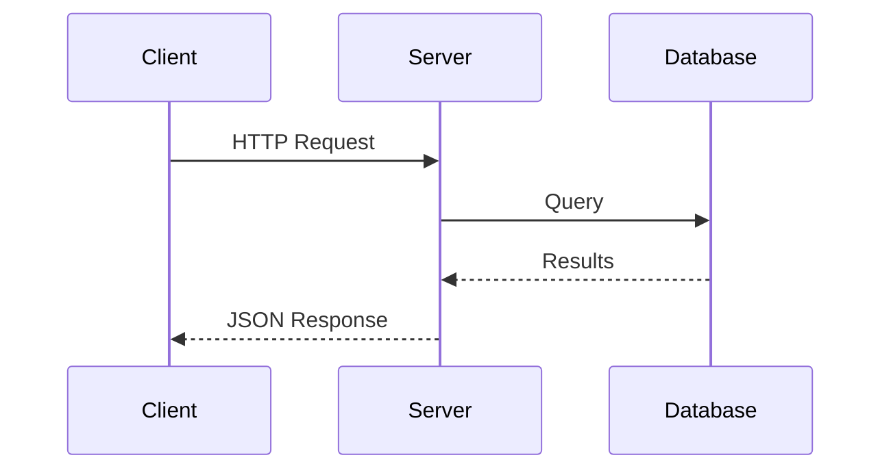

# mermaid-svg-render

Parse and render Mermaid diagrams to SVG in pure Rust.

## Table of Contents

- [Features](#features)
- [Installation](#installation)
- [Library Usage](#library-usage)
- [CLI Usage](#cli-usage)
- [Supported Diagram Types](#supported-diagram-types)
- [Documentation](#documentation)
- [License](#license)
- [Acknowledgments](#acknowledgments)

## Features

- **Pure Rust** - No JavaScript, no npm/node dependencies
- **Light and dark theme support**
- **Transparent background option**
- **Sequence diagram rendering** (more diagram types coming soon)

## Installation

### Library

Add this to your `Cargo.toml`:

```toml
[dependencies]
mermaid-svg-render = "0.1"
```

### CLI

```bash
cargo install mermaid-svg-render --features cli
```

Or build from source:

```bash
cargo build --release --features cli
```

## Library Usage

```rust
use mermaid_svg_render::{render_sequence_diagram, RenderOptions, Theme};

let input = r#"
sequenceDiagram
    Alice->>Bob: Hello Bob!
    Bob-->>Alice: Hello Alice!
"#;

let options = RenderOptions::with_theme(Theme::Light);
let svg = render_sequence_diagram(input, &options).unwrap();
println!("{}", svg);
```

### Transparent Background

```rust
use mermaid_svg_render::{render_sequence_diagram, RenderOptions, Theme};

let input = "sequenceDiagram\n    A->>B: Hello";

let options = RenderOptions::with_theme(Theme::Dark).transparent();
let svg = render_sequence_diagram(input, &options).unwrap();
```

## CLI Usage

The `msv` command-line tool renders Mermaid diagram files to SVG.

### Synopsis

```
msv [OPTIONS] <INPUT>
```

### Arguments

| Argument | Description |
|----------|-------------|
| `<INPUT>` | Path to input `.mmd` file |

### Options

| Option | Short | Description | Default |
|--------|-------|-------------|---------|
| `--output <FILE>` | `-o` | Output SVG file path | stdout |
| `--theme <THEME>` | `-t` | Color theme: `light` or `dark` | `light` |
| `--transparent` | | Use transparent background | solid |
| `--help` | `-h` | Print help information | |
| `--version` | `-V` | Print version | |

### Examples

#### Basic Rendering

```bash
# Render to stdout
msv diagram.mmd

# Render to file
msv diagram.mmd -o output.svg
```

#### Themes

```bash
# Light theme (default)
msv diagram.mmd -t light -o light.svg

# Dark theme
msv diagram.mmd -t dark -o dark.svg
```

#### Transparent Background

```bash
# Transparent background (useful for embedding in colored pages)
msv diagram.mmd --transparent -o transparent.svg

# Dark theme with transparent background
msv diagram.mmd -t dark --transparent -o dark-transparent.svg
```

#### Piping Output

```bash
# Pipe to another command
msv diagram.mmd | gzip > diagram.svg.gz

# Copy to clipboard (Linux)
msv diagram.mmd | xclip -selection clipboard
```

### Input Format

The input file should contain valid Mermaid diagram syntax:



### Exit Codes

| Code | Meaning |
|------|---------|
| `0` | Success |
| `1` | General error (file not found, invalid options, etc.) |
| `2` | Parse error (invalid Mermaid syntax) |

## Supported Diagram Types

| Diagram Type | Status |
|--------------|--------|
| Sequence diagrams | Partial |
| Flowcharts | Planned |
| Class diagrams | Planned |
| State diagrams | Planned |

### Sequence Diagram Features

The parser ([mermaid-parser](https://github.com/wballard/mermaid_parser)) supports these features. Rendering support status:

| Feature | Syntax | Rendering |
|---------|--------|-----------|
| Participants | `participant A` | Supported |
| Participant aliases | `participant A as Alice` | Supported |
| Actors | `actor A` | Supported |
| Solid arrow (sync) | `A->>B: msg` | Supported |
| Dotted arrow (async) | `A-->>B: msg` | Supported |
| Open arrows | `A->B:` / `A-->B:` | Supported |
| Cross (destroy) | `A-xB:` | Supported |
| Bidirectional | `A<<->>B:` | Supported |
| Self-messages | `A->>A: msg` | Supported |
| Multi-line names | `Alice<br/>Smith` | Supported |
| **autonumber** | `autonumber` | Planned |
| **Notes** | `note over A: text` | Planned |
| **Alt/Else blocks** | `alt`/`else`/`end` | Planned |
| **Opt blocks** | `opt`/`end` | Planned |
| **Loop blocks** | `loop`/`end` | Planned |
| **Par blocks** | `par`/`and`/`end` | Planned |
| **Critical blocks** | `critical`/`end` | Planned |
| **Activation** | `activate A` | Planned |
| **Create/Destroy** | `create`/`destroy` | Planned |

## Documentation

| Document | Description |
|----------|-------------|
| [Sequence Diagram Implementation](docs/diagrams/sequence.md) | Detailed status of sequence diagram features, parser AST structures, and rendering requirements |

## License

MIT OR Apache-2.0

## Acknowledgments

This crate uses [mermaid-parser](https://github.com/wballard/mermaid_parser) for parsing Mermaid syntax.
