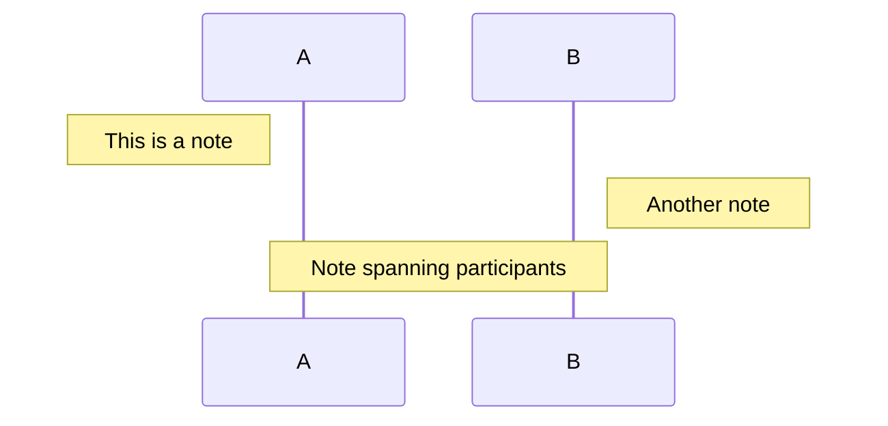
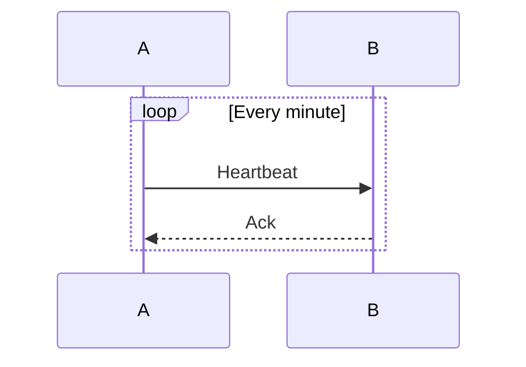
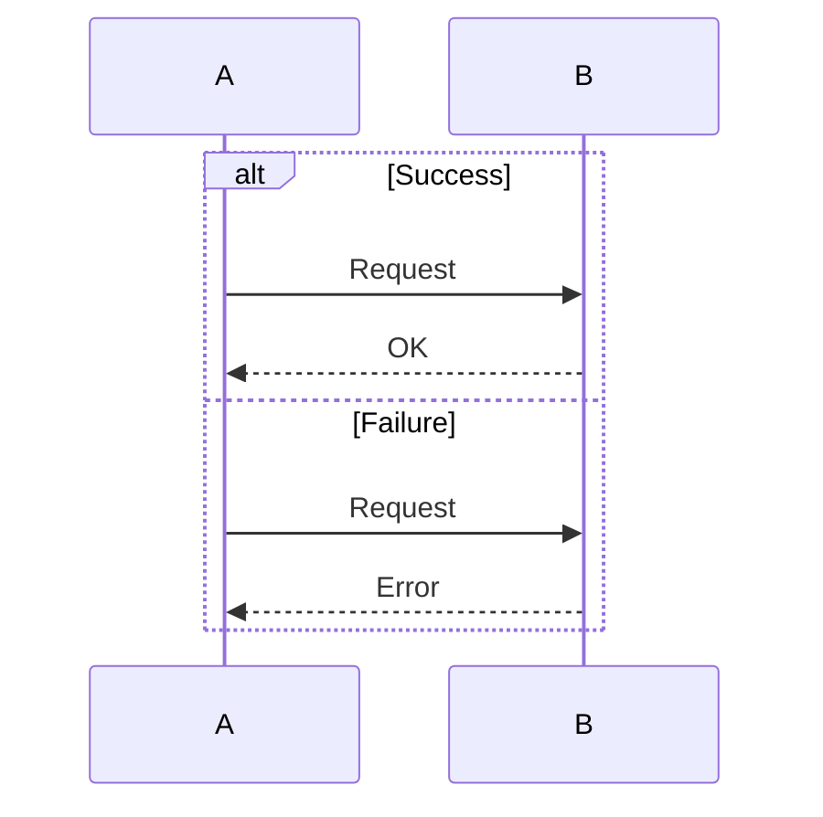
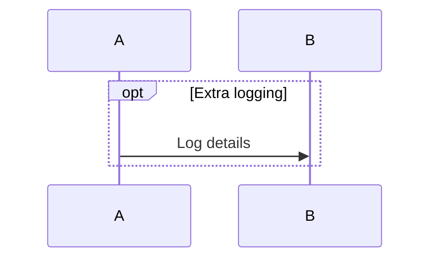
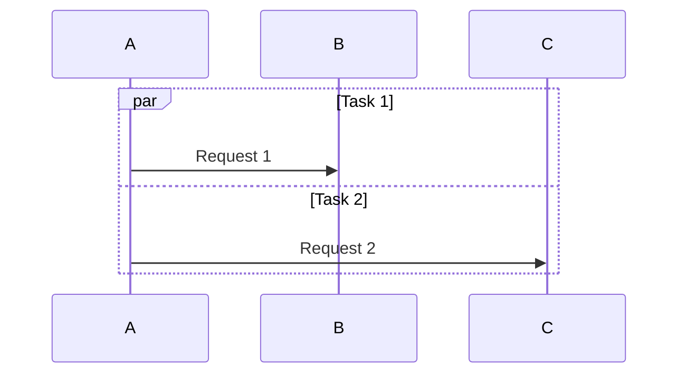
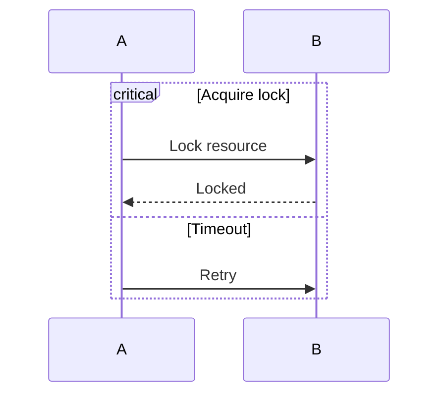
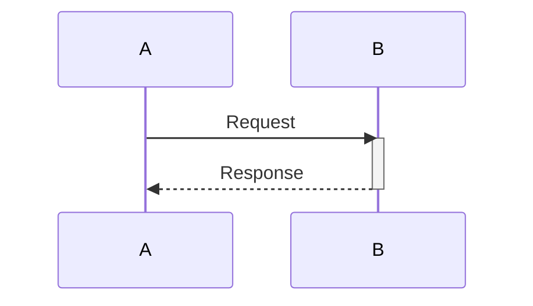
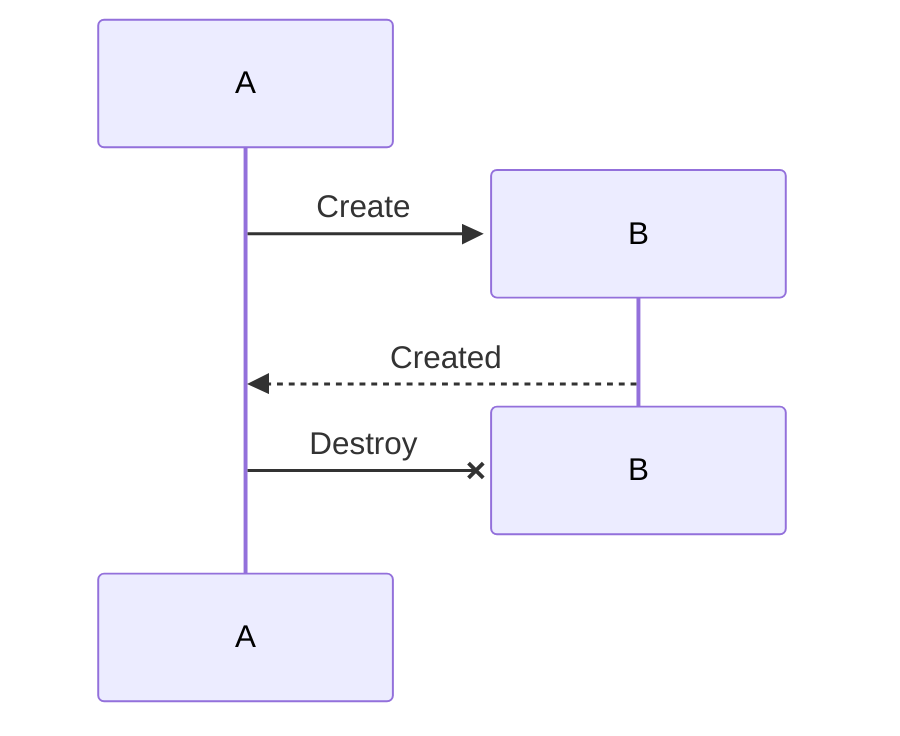

# Sequence Diagram - Implementation Status

This document tracks the implementation status of sequence diagram features parsed by `mermaid_parser`.

## SequenceStatement Support

| Statement | Status | Description |
|-----------|--------|-------------|
| `Message` | Implemented | Messages between participants with all arrow types |
| `Note` | Not Implemented | Notes attached to participants |
| `Loop` | Not Implemented | Loop control structure |
| `Alt` | Not Implemented | Alternative (if/else) control structure |
| `Opt` | Not Implemented | Optional control structure |
| `Par` | Not Implemented | Parallel execution blocks |
| `Critical` | Not Implemented | Critical section blocks |
| `Activate` | Not Implemented | Activation bars on lifelines |
| `Deactivate` | Not Implemented | Deactivation of lifelines |
| `Create` | Not Implemented | Dynamic participant creation |
| `Destroy` | Not Implemented | Participant destruction |

## Not Implemented Features

### Note

Adds a note annotation to the diagram.



**Parser AST:**
```rust
pub struct Note {
    pub position: NotePosition,
    pub actor: String,
    pub actor2: Option<String>,  // For "over A,B" syntax
    pub text: String,
}

pub enum NotePosition {
    LeftOf,
    RightOf,
    Over,
}
```

**Rendering Requirements:**
- Rectangular box with slightly rounded corners or folded corner style
- Position relative to participant lifeline
- Support spanning multiple participants with `Over`

---

### Loop

Repeating block of messages.



**Parser AST:**
```rust
pub struct Loop {
    pub label: String,
    pub statements: Vec<SequenceStatement>,
}
```

**Rendering Requirements:**
- Rectangular frame around contained messages
- Label in top-left corner (e.g., "loop [Every minute]")
- Support nested statements

---

### Alt (Alternative)

Conditional branching with if/else semantics.



**Parser AST:**
```rust
pub struct Alternative {
    pub condition: String,
    pub statements: Vec<SequenceStatement>,
    pub else_statements: Vec<(String, Vec<SequenceStatement>)>,
}
```

**Rendering Requirements:**
- Rectangular frame with "alt" label
- Dashed horizontal line separating alternatives
- "else" label on separator line
- Support multiple else branches

---

### Opt (Optional)

Optional block that may or may not execute.



**Parser AST:**
```rust
pub struct Optional {
    pub condition: String,
    pub statements: Vec<SequenceStatement>,
}
```

**Rendering Requirements:**
- Rectangular frame with "opt" label
- Condition text in bracket notation

---

### Par (Parallel)

Parallel execution blocks.



**Parser AST:**
```rust
pub struct Parallel {
    pub label: String,
    pub statements: Vec<SequenceStatement>,
    pub and_statements: Vec<(String, Vec<SequenceStatement>)>,
}
```

**Rendering Requirements:**
- Rectangular frame with "par" label
- Dashed horizontal lines separating parallel sections
- "and" label on separator lines

---

### Critical

Critical section that must complete atomically.



**Parser AST:**
```rust
pub struct Critical {
    pub label: String,
    pub statements: Vec<SequenceStatement>,
    pub option_statements: Vec<(String, Vec<SequenceStatement>)>,
}
```

**Rendering Requirements:**
- Rectangular frame with "critical" label
- Optional "option" sections with separators

---

### Activate / Deactivate

Activation bars showing when a participant is active.



**Parser AST:**
```rust
Activate(String)   // participant name
Deactivate(String) // participant name
```

**Rendering Requirements:**
- Narrow rectangle overlaid on lifeline
- Track activation depth for nested activations
- Different shading or offset for stacked activations

---

### Create / Destroy

Dynamic participant lifecycle management.



**Parser AST:**
```rust
Create(Participant)  // Full participant struct
Destroy(String)      // participant name
```

**Rendering Requirements:**
- `Create`: Participant box appears at message Y position (not at top)
- `Destroy`: X mark on lifeline, lifeline ends at that point

---

## Participant Types

### Current Implementation

Both types render as rectangular boxes:

| Type | Keyword | Rendering |
|------|---------|-----------|
| Participant | `participant` | Rectangle box |
| Actor | `actor` | Rectangle box (should be stick figure) |

### Planned

- `actor` keyword should render as stick figure icon
- Parser mentions but doesn't implement: `boundary`, `control`, `entity`

---

## Implementation Priority

Suggested order based on usage frequency and complexity:

1. **Note** - Common, relatively simple
2. **Activate/Deactivate** - Common, moderate complexity
3. **Alt** - Common control flow
4. **Loop** - Common control flow
5. **Opt** - Less common, similar to Alt
6. **Par** - Less common, similar to Alt
7. **Critical** - Less common
8. **Create/Destroy** - Requires lifeline modification
9. **Actor rendering** - Visual improvement
